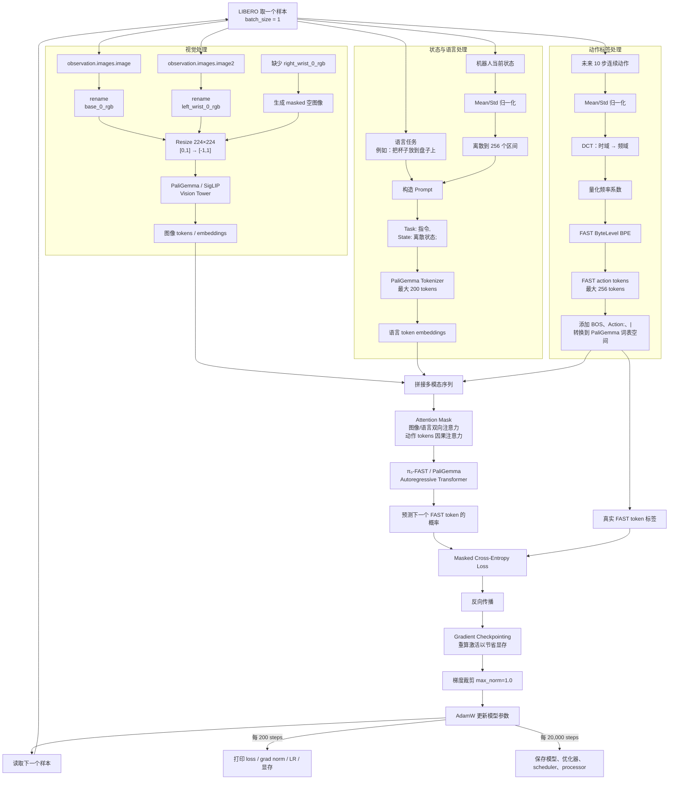

```mermaid
flowchart TD
    A["LIBERO 取一个样本<br/>batch_size = 1"]

    A --> I1["observation.images.image"]
    A --> I2["observation.images.image2"]
    A --> S["机器人当前状态"]
    A --> T["语言任务<br/>例如：把杯子放到盘子上"]
    A --> AC["未来 10 步连续动作"]

    subgraph VIS["视觉处理"]
        I1 --> R1["rename<br/>base_0_rgb"]
        I2 --> R2["rename<br/>left_wrist_0_rgb"]
        R3["缺少 right_wrist_0_rgb"] --> E["生成 masked 空图像"]
        R1 --> IMG["Resize 224×224<br/>[0,1] → [-1,1]"]
        R2 --> IMG
        E --> IMG
        IMG --> VT["PaliGemma / SigLIP<br/>Vision Tower"]
        VT --> IE["图像 tokens / embeddings"]
    end

    subgraph LANG["状态与语言处理"]
        S --> SN["Mean/Std 归一化"]
        SN --> BIN["离散到 256 个区间"]
        T --> PROMPT["构造 Prompt"]
        BIN --> PROMPT
        PROMPT --> PS["Task: 指令,<br/>State: 离散状态;"]
        PS --> PT["PaliGemma Tokenizer<br/>最大 200 tokens"]
        PT --> LE["语言 token embeddings"]
    end

    subgraph ACT["动作标签处理"]
        AC --> AN["Mean/Std 归一化"]
        AN --> DCT["DCT：时域 → 频域"]
        DCT --> Q["量化频率系数"]
        Q --> BPE["FAST ByteLevel BPE"]
        BPE --> AT["FAST action tokens<br/>最大 256 tokens"]
        AT --> WRAP["添加 BOS、Action:、|<br/>转换到 PaliGemma 词表空间"]
    end

    IE --> CAT["拼接多模态序列"]
    LE --> CAT
    WRAP --> CAT

    CAT --> MASK["Attention Mask<br/>图像/语言双向注意力<br/>动作 tokens 因果注意力"]
    MASK --> MODEL["π₀-FAST / PaliGemma<br/>Autoregressive Transformer"]
    MODEL --> LOGITS["预测下一个 FAST token 的概率"]
    WRAP --> TARGET["真实 FAST token 标签"]
    LOGITS --> LOSS["Masked Cross-Entropy Loss"]
    TARGET --> LOSS

    LOSS --> BACK["反向传播"]
    BACK --> GC["Gradient Checkpointing<br/>重算激活以节省显存"]
    GC --> CLIP["梯度裁剪 max_norm=1.0"]
    CLIP --> OPT["AdamW 更新模型参数"]
    OPT --> NEXT["读取下一个样本"]
    NEXT --> A

    OPT -->|"每 200 steps"| LOG["打印 loss / grad norm / LR / 显存"]
    OPT -->|"每 20,000 steps"| CKPT["保存模型、优化器、scheduler、processor"]
```